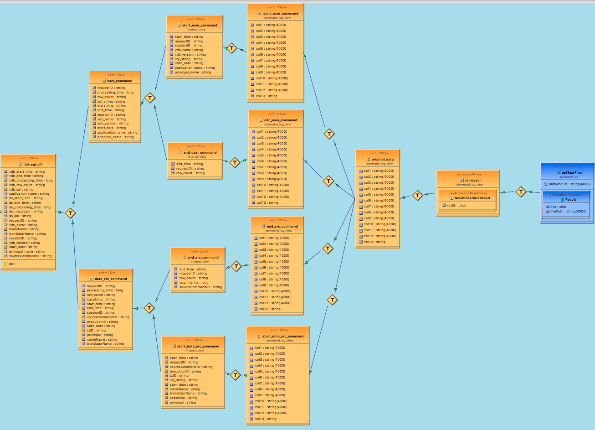

# jdv_command_log_view

# precondition
 - Installed JDV 6.3
 - Installed JBDS 9.1(or later)
 - Installed JBDS IS
 - adding JDV server start script
    [-Dorg.teiid.maxStringLength=400000000(file size)]

# Import PJ into JBDS workspace(from zip file)
 - open JBDS workspace
 - select light click menu [Import]
 - select [Genera] - [Existing Project into Workspace]，
 - select  [Select archive file] and set the zip file
 - set and run JDV server
 - select <command_log.xml> file
 - select right click menu[Modeling]-[Create Data Source]
 - set adequate path and create file data source into JDV server as 'command_log'  
     <file name is fixed as 'teiid-command.log'>
 - select 'command_log_vdb.vdb'
 - select right click menu[Modeling]-[Deploy]

# Direct deploy to JDV server
 - run JDV Server
 - open admin cosole
 - create 'Resource Adapter' at <Configuration tab>
   - Name: 'command_log'
   - Module: 'org.jboss.teiid.resource-adapter.file:main'
   - Tx: No Tx
   - Add option JNDI: java:/command_log
   - Add option Connection class: org.teiid.resource.adapter.file.FileManagedConnectionFactory
   - Add option propertiry(key): ParentDirectory
   - Add option propertiry(value): <adequate path>
   - Deploy VDB file

# How to use VDB
  - connect JDV(jdbc:teiid:command_log_vdb@mm://localhost:31000)
  - Schema: ：public_view
  - Tabes(<*> is used frequently)
    <*> jdv_sql_without_sysdata --- vdb SQL, Data Source SQL, and other information except for SYS.XXX query
　    (start time, end time, duration time, return rows, and other information)
    -  jdv_sql_all --- vdb SQL, Data Source SQL, and other information
　    (start time, end time, duration time, return rows, and other information)
    - user_command --- vdb SQL information
    - data_src_command --- ds information　
    - user_command_groups --- vdb sql pattern, total number, and average duration time
    - data_src_command_groups --- ds sql pattern, total number, and average duration time
  - Procedure:
    - jdv_sql_inc_keyword --- data extract jdv_sql using keywork from JDV SQL and DS SQL
    - proc_clear_cache --- cleare cache procedure
    
    
    
# Notice
  This tool is very slow. In my mac laptop, it takes 10 min to import 10MB file. So, in the case of large file, please use divided it. 
